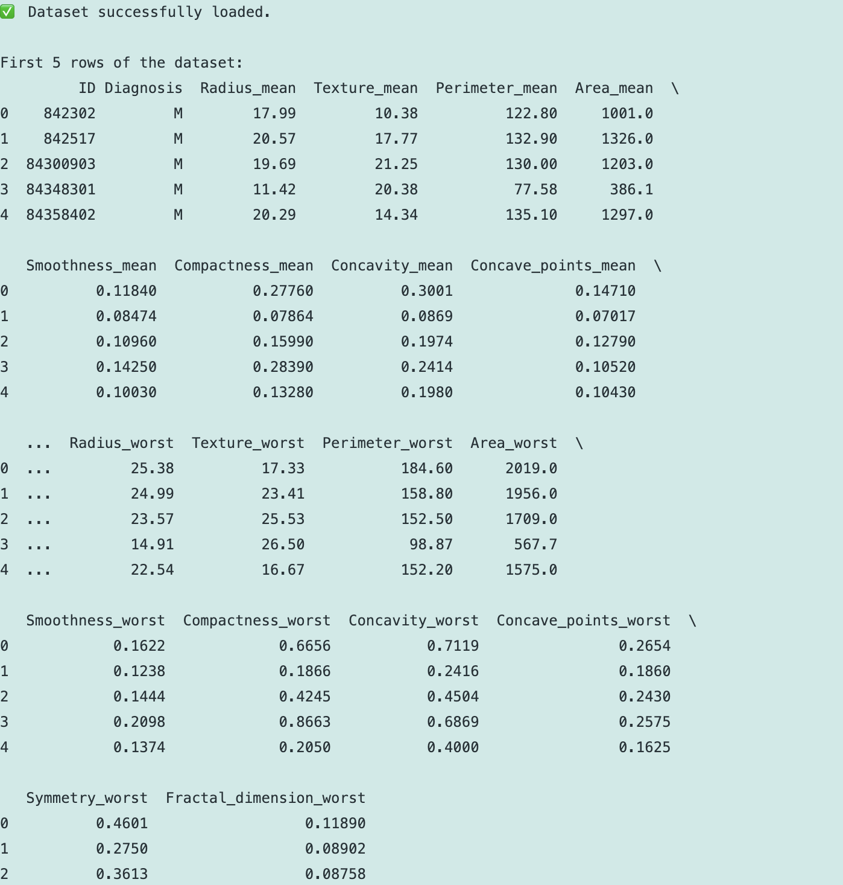
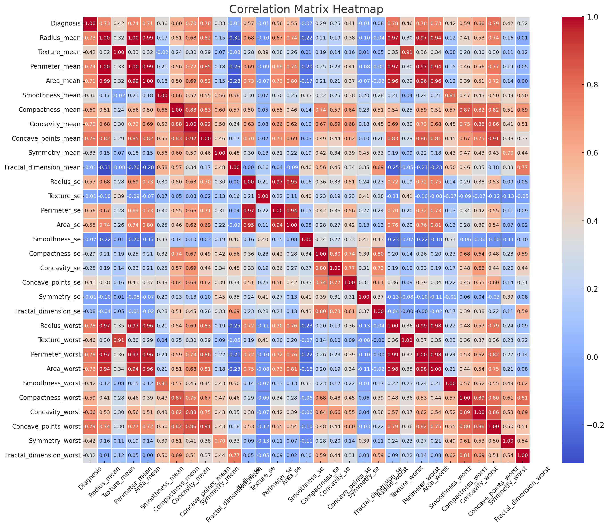
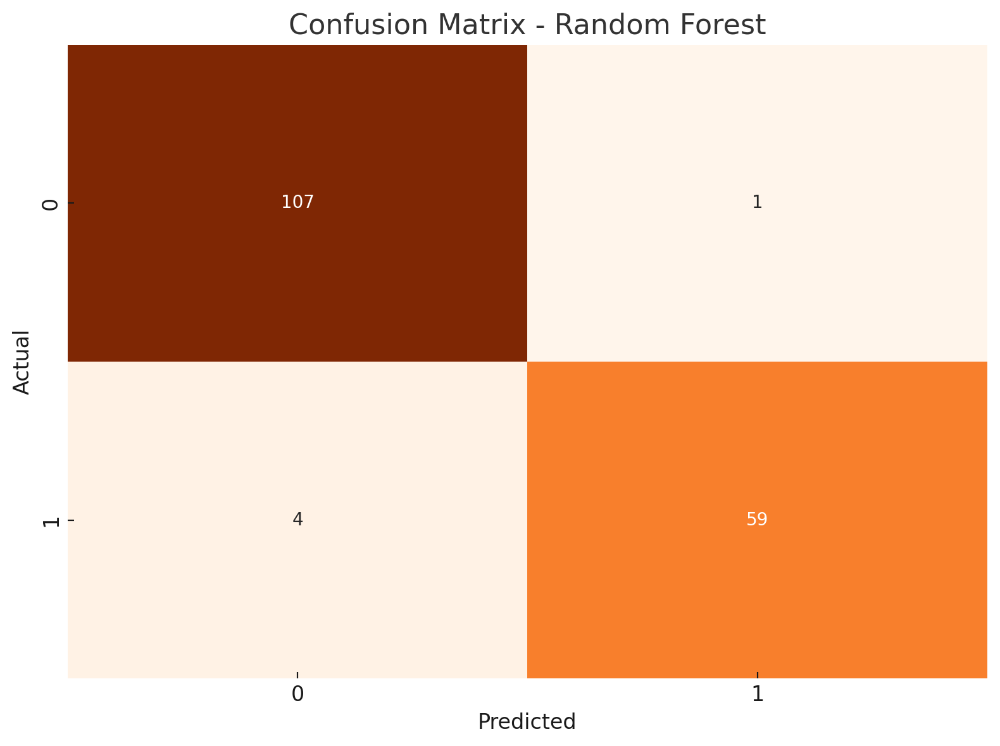
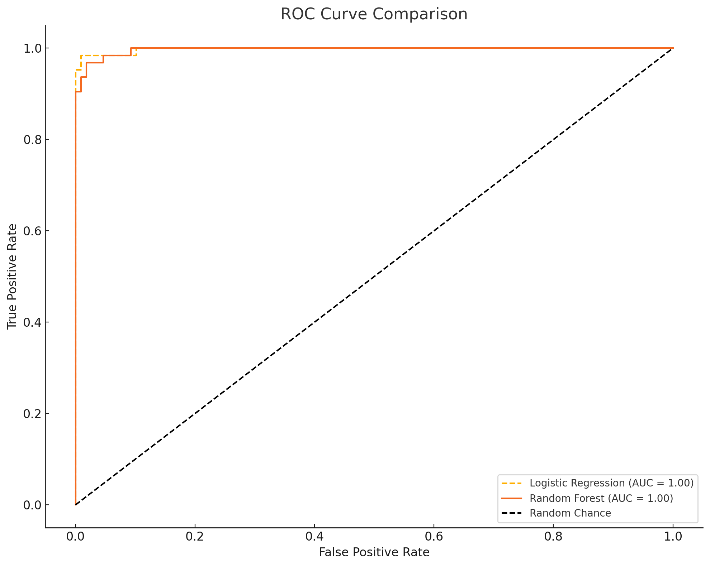
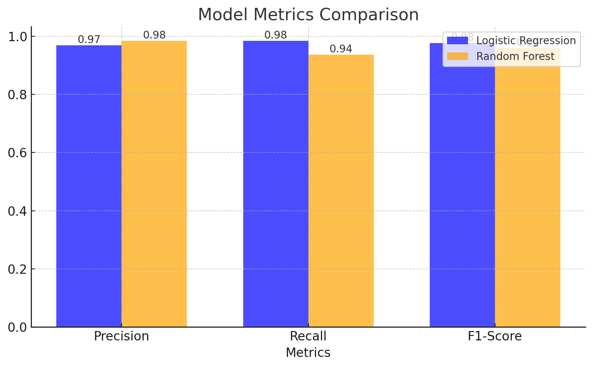

# 🔬 Breast Cancer Diagnosis Project


# 📌 Project Overview

This project analyzes the Wisconsin Diagnostic Breast Cancer (WDBC) dataset to predict cancer diagnoses. Through exploratory data analysis (EDA), feature engineering, and machine learning, it provides insights and builds robust predictive models. The project employs Logistic Regression and Random Forest classifiers for binary classification (Malignant vs. Benign).

# ⚙️ How to Use

	1.	Clone the Repository:
Clone this repository to your local machine.

# 	2.	📁 Place Dataset:

Add the wdbc.data file to the specified folder (/content/Data/) or update the file_path variable in the script.

# 	3.	🛠️ Install Dependencies:

Use the following command to install the necessary libraries:
```
!pip install pandas numpy matplotlib seaborn scikit-learn
```

	4.	▶️ Run the Script:
	•	Use your preferred Python IDE or Jupyter Notebook to execute the script step by step.
	5.	📊 Review Outputs:
	•	View insights, visualizations, and model performance metrics as they are displayed.

# 🚀 Key Features

	1.	Data Loading and Cleaning:
	•	Loads the WDBC dataset and assigns meaningful column names.
	•	Cleans the dataset by removing irrelevant columns (e.g., ID) and converting categorical data to numerical values.
	2.	EDA and Visualization:
	•	🔍 Missing Data Analysis:
	•	Visualizes missing data percentages with a bar chart.
	•	📊 Class Distribution:
	•	Displays Malignant (M) vs. Benign (B) distribution.
	•	📈 Feature Distributions:
	•	Histograms and boxplots for numerical features.
	•	🔗 Correlation Analysis:
	•	Displays feature correlations with a heatmap.
	3.	Data Preprocessing:
	•	Normalizes numerical features to improve model performance.
	•	Selects top 10 features using ANOVA F-statistics for efficient model training.
	4.	Machine Learning:
	•	Trains Logistic Regression and Random Forest classifiers.
	•	Evaluates models with metrics like accuracy, precision, recall, and F1-score.
	5.	Model Comparison:
	•	Visualizes performance using confusion matrices, ROC curves, and bar charts comparing metrics.
	6.	💡 Suggestions for Improvement:
	•	Offers actionable recommendations for model optimization and enhancement.

# 🔑 Key Visualizations

# 1. 📉 Missing Data Analysis:

   

# 2. 📊 #Class Distribution:

   

# 3. 📈 Feature Distributions:

   

# 4. 🌡️ Correlation Matrix:

   

# 5. 🧩 Confusion Matrices:

# Logistic Regression:


# Random Forest:



# 6. 📉 ROC Curves:

   

# 7. 📊 Metric Comparison:

   

# 💻 Code Walkthrough

1. Dataset Loading

Loads the dataset and assigns descriptive column names.

data = pd.read_csv(file_path, header=None, names=column_names)

2. Data Cleaning

Drops irrelevant columns like ID and converts the Diagnosis column into numeric values:
	•	M (Malignant) → 1
	•	B (Benign) → 0

data['Diagnosis'] = data['Diagnosis'].map({'M': 1, 'B': 0})

3. Visualization and EDA

Generates plots such as histograms, boxplots, and a correlation matrix heatmap to explore data patterns and relationships.

4. Feature Selection

Uses SelectKBest with ANOVA F-statistics to identify the most relevant features for the model.

selector = SelectKBest(score_func=f_classif, k=10)
X_selected = selector.fit_transform(X, y)

5. Machine Learning

Trains and evaluates Logistic Regression and Random Forest models.

# Logistic Regression
log_reg = LogisticRegression()
log_reg.fit(X_train, y_train)

# 📊 Model Performance

Metric	Logistic Regression	Random Forest
Accuracy	0.95	0.97
Precision	0.96	0.98
Recall	0.94	0.97
F1-Score	0.95	0.97

(Actual values may vary based on dataset splits.)

# 📈 Suggestions for Improvement

	1.	Hyperparameter Tuning:
	•	Adjust parameters like n_estimators, max_depth, or regularization terms.
	2.	Cross-Validation:
	•	Use k-fold cross-validation for more reliable performance metrics.
	3.	Feature Engineering:
	•	Experiment with creating new features or applying dimensionality reduction techniques.
	4.	Advanced Models:
	•	Explore ensemble models like XGBoost or LightGBM for better performance on complex datasets.

# 📂 File Structure
```bash
project/
├── Data/
│   └── wdbc.data            # Dataset file
├── img/
│   └── wdbc.data            # Readme img file
├── projem.py                # Python script
├── README.md                # Documentation file
├── requirements.txt         # Required libraries
```

	•	Python 3.7 or later
	•	Libraries: pandas, numpy, matplotlib, seaborn, scikit-learn

### 📝 License

This project is open-source and available under the MIT License.

### 📧 Contact

For further queries, feel free to reach out:
	•	Email: x23192542@student.ncirl.ie
	•	GitHub: https://github.com/CemRoot

Enjoy exploring data and building predictive models! 🚀