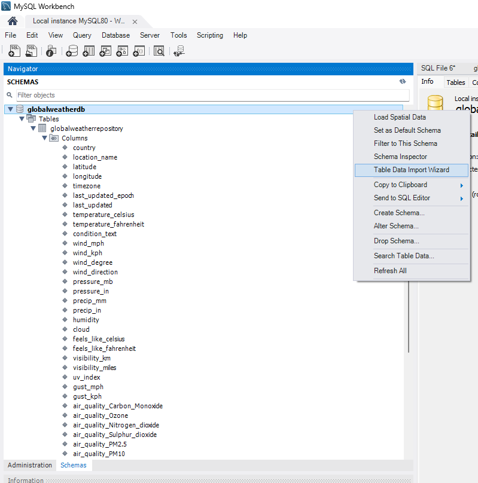
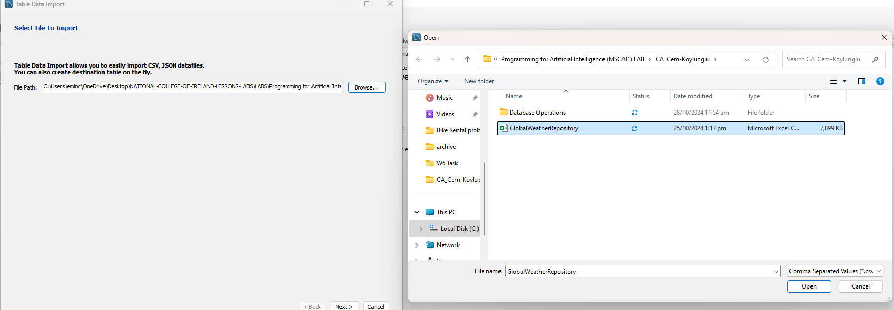
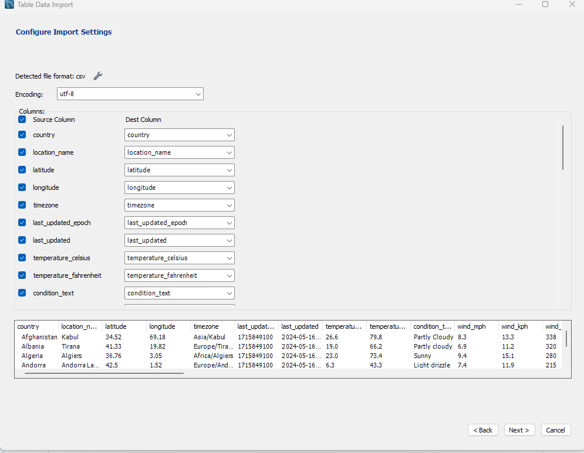
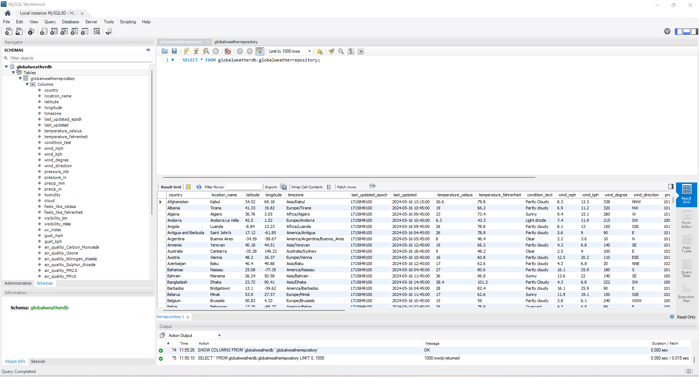
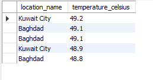
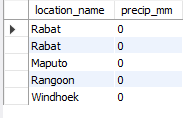
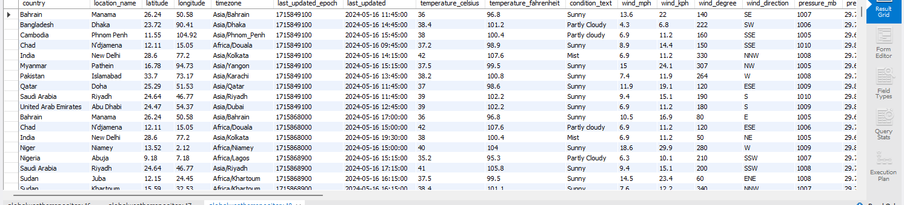
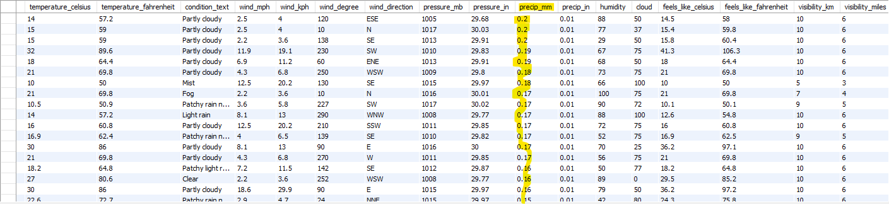
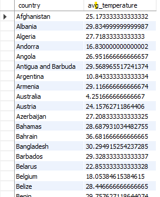
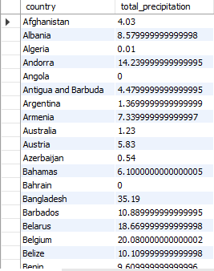

# MySQL Database Activities for World Climate Data


### Step 1: Establish Database

Create a fresh database called `GlobalWeatherDB` first to hold meteorological information.

```sql
CREATE DATABASE GlobalWeatherDB;
```

### Step 2: build the table.

To conduct further actions, go to the `GlobalWeatherDB` database.

```sql
USE GlobalWeatherDB;
```

### Step 3: Create the Table

I created a database table named "**globalweatherrepository**", then chose the table from the MySQL workbench and the "import data wizard" part to automatically copy the whole csv file straight forwardly.
***

***

***


### Step 4:  review the table

Run the following search to confirm the successful creation of the table:
```sql
SELECT * FROM globalweatherdb.globalweatherrepository;;
```


### Step 5: search data

#### a)  Get the Top 5 Highest Temperatures Locations

This search pulls up the top 5 records with Celsius temperatures.
```sql
SELECT location_name, temperature_celsius 
FROM globalweatherrepository
ORDER BY temperature_celsius DESC 
LIMIT 5;
```


#### b) Get the Top 5 Locations with the Lowest Precipitation

This search returns the top five sites with the lowest known precipitation figures.

```sql
SELECT location_name, precip_mm 
FROM globalweatherrepository
WHERE precip_mm IS NOT NULL
ORDER BY precip_mm ASC 
LIMIT 5;
```


#### c) Get Records Comfitting Particular Conditions

1. **Retrieve all data wherein the temperature exceeds 35°C**:

   ```sql
   SELECT * 
   FROM globalweatherrepository
   WHERE temperature_celsius > 35;
   ```
   

2. **Retrieve all records where precipitation is greater than 100 mm**:

   ```sql
   SELECT * 
   FROM globalweatherrepository
   WHERE precip_mm < 1.00;
   ```


#### d) Organize By Operations

1. **Average Temperature by Country**:

   This query calculates the average temperature for each country.

   ```sql
   SELECT country, AVG(temperature_celsius) AS avg_temperature
   FROM globalweatherrepository
   GROUP BY country;
   ```



2. **Total Precipitation by Country**:

   This question figures every nation's overall precipitation.

```sql
SELECT country, SUM(precip_mm) AS total_precipitation
FROM globalweatherrepository
GROUP BY country;
  ```


